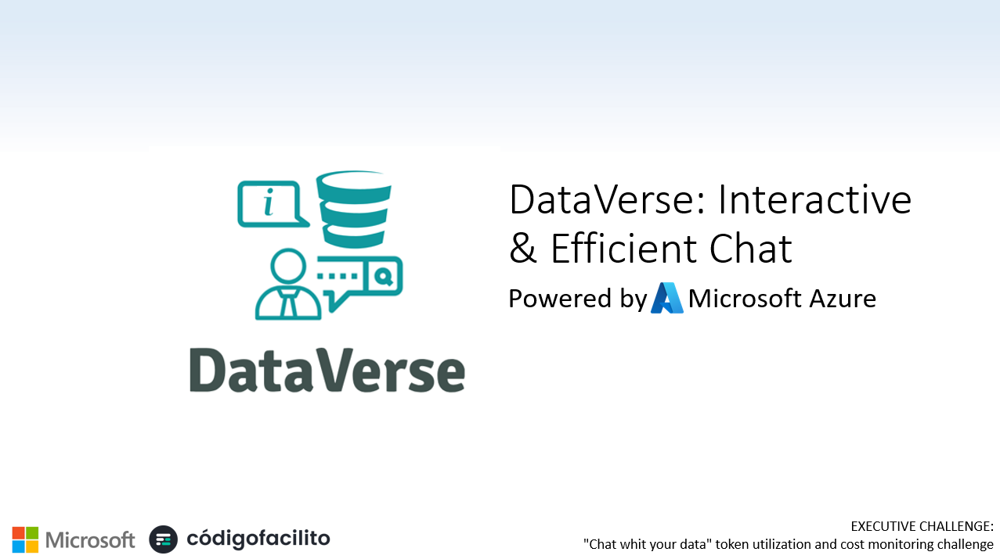
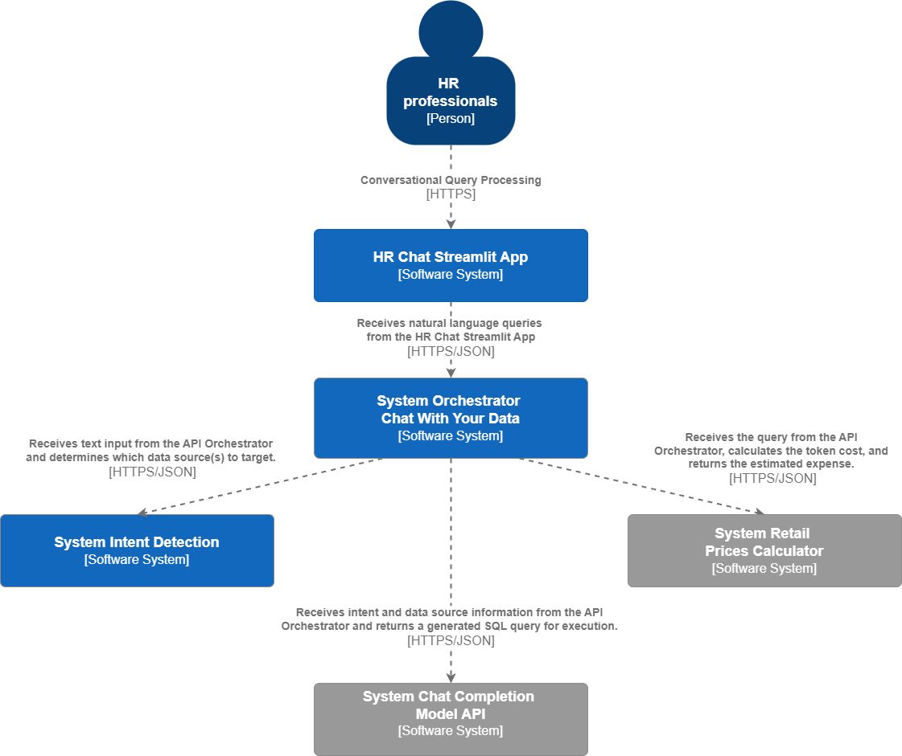
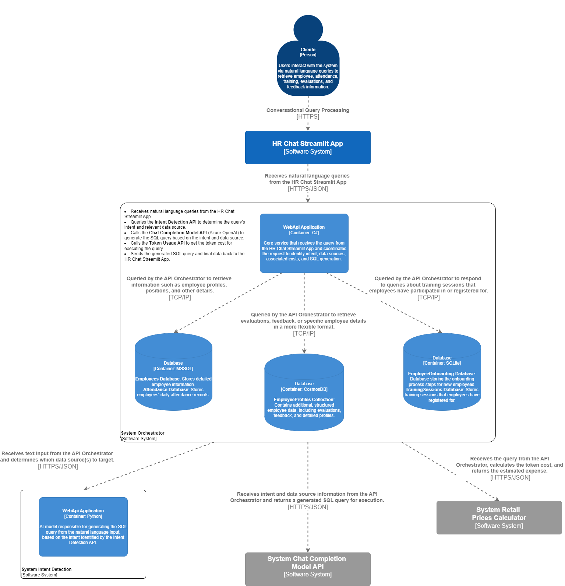
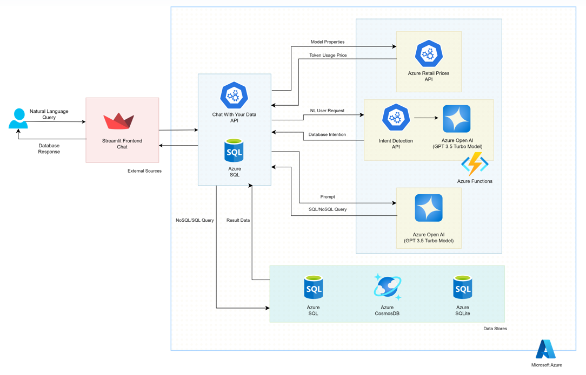
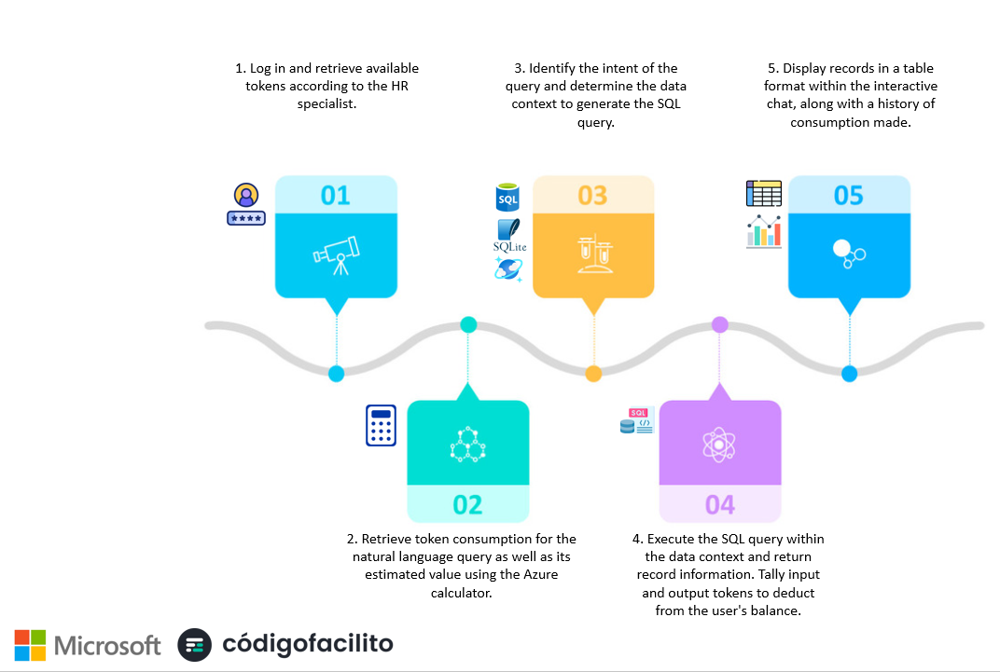
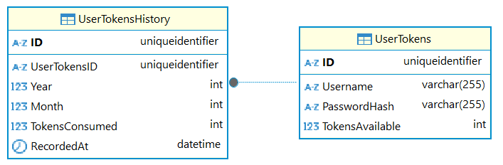
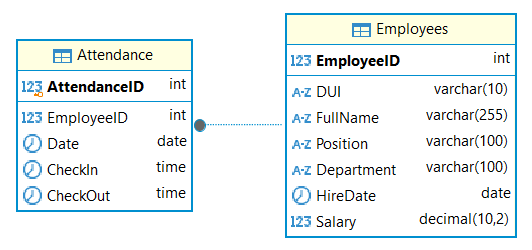
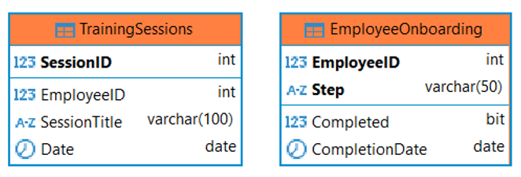
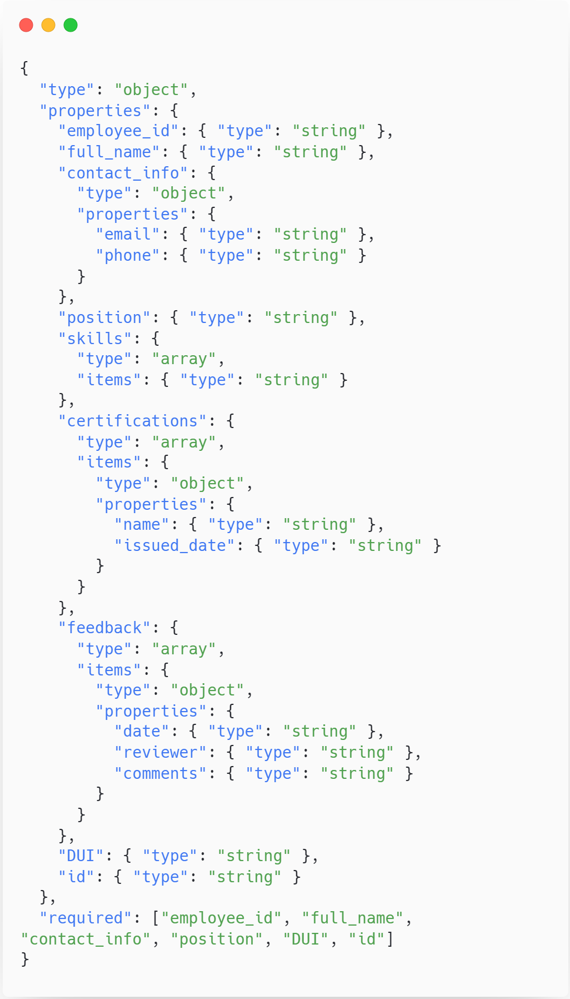

# DataVerse: Interactive & Efficient Chat 
<a href="https://youtu.be/nuuE4h0uz3k" target="blank">
	
	Watch in Action
</a>

## Project Description

DataVerse is an intuitive, interactive chat solution designed specifically for HR professionals to access and analyze employee data from multiple sources. By simply asking questions in everyday language, HR users can retrieve relevant information about their workforce, making it easier to make informed decisions quickly. DataVerse eliminates the need for technical expertise, allowing HR teams to interact with complex data seamlessly through a conversational interface.

## Key Objectives

1. **Empower HR with Natural Language Access**: Enable non-technical users to obtain essential workforce insights through natural language queries, removing the need for SQL knowledge.
   
2. **Unified Data Access from Multiple Sources**: Integrate information from various databases, streamlining access to diverse employee data in a single, cohesive interface.

3. **Transparency in Cost and Usage**: Monitor system utilization to provide visibility into query costs and resource usage, ensuring efficient and cost-effective operations.

## Features

- **Conversational Query Processing**: Easily access employee data by typing questions like “Show attendance for October” or “List employees enrolled in training.”
- **Smart Data Integration**: Pulls and aggregates information from various sources into one easy-to-use platform.
- **Usage Monitoring**: Tracks data retrieval costs, helping users understand and manage usage effectively.

With DataVerse, HR teams gain direct access to valuable insights, simplifying data-driven decision-making through an engaging and efficient chat interface.

## Architecture The C4 model for visualising software architecture

This document describes the architecture of software systems, based on communication.
efficiently and effectively the software architecture, at different levels of detail,
telling different stories to different types of audiences, This will be refined as
Architectural decisions mature and the project moves forward.

### System context diagram

A System Context diagram is a good starting point for diagramming and documenting a software system, allowing you to step back and see the big picture. Draw a diagram showing your system as a box in the centre, surrounded by its users and the other systems that it interacts with.

### Container diagram

The Container diagram shows the high-level shape of the software architecture and how responsibilities are distributed across it. It also shows the major technology choices and how the containers communicate with one another. It’s a simple, high-level technology focussed diagram that is useful for software developers and support/operations staff alike.

## Components

| Component                  | Description                                                                                                                                                                                                                   |
|----------------------------|-------------------------------------------------------------------------------------------------------------------------------------------------------------------------------------------------------------------------------|
| **Streamlit Frontend Chat** | An interactive user interface that allows users to send natural language queries and receive real-time responses. This component facilitates communication with the "Chat With Your Data" API.                                |
| **Chat With Your Data API (Azure App Service)** | The main API that manages user requests, translates natural language queries into SQL/NoSQL queries, and coordinates interactions with other services and APIs, including intent detection and pricing handling.             |
| **Azure SQL**               | A relational database that stores structured data, including tables like `UserTokens` and `UserTokensHistory`. It is also used to store results and manage token consumption.                                               |
| **Intent Detection API (Azure Functions)**    | API that identifies the user's natural language query intent, helping determine the appropriate data context for generating SQL or NoSQL queries.                                                                           |
| **Azure Open AI (GPT-3.5)** | AI service that processes natural language queries, helping transform them into specific context SQL/NoSQL queries. It is used to generate queries and obtain more accurate responses.                                      |
| **Azure Retail Prices API** | API that fetches the current pricing for Azure models and services, allowing estimation of token consumption and costs associated with each query or process.                                                                |
| **Azure Functions**         | A serverless function execution component, used to facilitate connections between APIs and services. It enables dynamic scalability and processes specific queries or requests that require additional processing.            |
| **Azure Cosmos DB**         | A highly scalable NoSQL database that stores semi-structured data, complementing the SQL database and enabling flexible storage for queries and storage purposes.                                                            |
| **Azure SQLite**            | A lightweight database for local or temporary data storage, useful for testing or storing non-critical data.                                                                                                               |

## Process flow

## Database diagram

This database consists of two main tables designed to manage user authentication tokens and track their usage over time.

## MSSQL Database

- Stores daily employee attendance records.
- Stores detailed employee information.

## SQLite Database

- Stores the steps of the onboarding process for new employees.
- Stores the training sessions that employees have registered for.

## CosmosDB Database

- Contains additional structured employee data, including reviews, comments, and detailed profiles.

